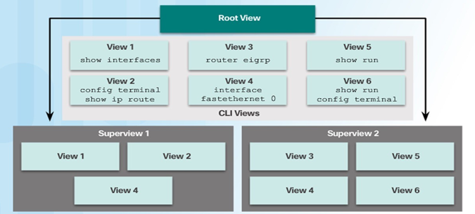

# 1.1.2
## Contraseña secreta
    enable algorithm-type { md5 | scrypt | sha256 } secret unencrypted-password
    
## Asegurar dispositivo
- La asignación de contraseñas y autenticación local no evita que un dispositivo sea  blanco de un ataque.
- Estas mejoras de inicio de sesión solo se pueden habilitarse si la base de datos  local se utiliza para la autenticación para el acceso local y remoto.

login block-for, este comando monitorea la actividad del dispositivo de  inicio de sesión y opera en dos modos: Modo Normal y Modo Silencioso

    -   login block-for [seconds] attempts [num-tries] within [num-seconds]
    -   login quiet-mode access-class {acl-name | acl-number}
    -   login delay [seconds]
    -   login on-success log [every login]
    -   login on-failure log [every login]

## Configuracion de SSH
    -   configure terminal
    -   hostname [name]
    -   crypto key generate rsa general-keys modulus 1024
    -   username [username] secret [password]
    -   line vty 0 4
            -   login local
            -   transport input ssh
            -   exit

## Niveles de privilegios
De forma predeterminada, los dispositivos cisco tiene dos niveles de acceso a los  comandos:
- Modo EXEC de usuario (nivel de privilegio 1): Proporciona los privilegios de  usuario del modo EXEC más bajo y solo permite comandos de nivel de  usuario disponibles en el indicador del router>.
- Modo EXEC privilegiado (nivel de privilegio 15): Incluye todos los comandos  de nivel de habilitación en el indicador del número de enrutador.
- Nivel 0: predefinido para privilegios de acceso a nivel usuario. Rara vez se usa, pero incluye cinco comandos: deshabilitar, habilitar, salir, ayudar y cerrar sesión.
- Nivel 1: El nivel predeterminado para inciar sesión con el indicador del enrutador Router>. Un usuario no puede realizar cambios ni ver el archivo de configuración en ejecución.
- Nivel 2-14: Se pueden personalizar para privilegios de nivel usuario. Los comandos de niveles inferiores se pueden mover a otro nivel superior, o los comandos de niveles superiores se pueden mover a un nivel inferior.
- Nivel 15: Reservado para los privilegios del modo de **Habilitación**(comando de habilitacion). Los usuarios pueden cambiar configuraciones y ver archivos de configuración.

## Configurar niveles de privilegios
    privilege [mode] { level level | reset } command
    ejemplo: privilege exec level 5 show ip interface

## Acceso CLI Basado en Roles

### Root View:
    Para configurar cualquier vista del sistema, el administrador debe estar en la vista raíz, que tiene los mismos privilegios de acceso que un usuario con privilegios de nivel 15. Sin embargo, una vista raíz no es lo mismo que un usuario de nivel 15. Solo un usuario de vista raíz puede configurar una nueva vista y agregar o eliminar comandos de las vistas existentes.

    Este es el nivel más alto en la jerarquía de visualización (View). Desde el Root View, los usuarios con los privilegios adecuados pueden ver y gestionar todas las CLI Views.
    El Root View tiene acceso completo a todos los comandos y configuraciones del dispositivo.

### CLI Views:
    Se puede agrupar un conjunto específico de comandos en una vista CLI.  A diferencia de los niveles de privilegios, una vista CLI no tiene jerarquía de comandos ni vistas superiores o inferiores. A cada vista se le deben asignar todos los comandos asociados. Una vista no hereda comandos de ninguna otra vista.  Además, los mismos comandos se pueden utilizar en varias vistas.
    
    Una View es una colección de comandos específicos a los que un usuario tiene acceso. Puedes crear diferentes vistas para diferentes propósitos, por ejemplo, restringir el acceso a algunos comandos.
    En la imagen, hay diferentes CLI Views creadas, como:
    - View 1: contiene los comandos show interfaces.
    - View 2: contiene los comandos config terminal y show ip route.
    - View 3: contiene el comando router eigrp.
    - View 4: contiene el comando interface fastethernet 0.
    - View 5: contiene el comando show run.
    - View 6: contiene los comandos show run y config terminal.

Las CLI Views son útiles para limitar qué comandos puede ejecutar un usuario, por ejemplo, dar acceso a solo unos pocos comandos de visualización (como show interfaces), pero bloquear los comandos de configuración.

### Superviews:
    Consta de una o más vistas CLI. Los administradores pueden definir qué comandos se aceptan y qué información de configuración es visible. Las supervistas permiten que un administrador de red asigne usuarios y grupos de usuarios a múltiples vistas CLI.
    
    Una Superview es una colección de varias CLI Views. Es una forma de agrupar múltiples vistas en un solo lugar para facilitar la gestión.
    En la imagen, hay dos Superviews:
    - Superview 1 contiene View 1, View 2 y View 4.
    - Superview 2 contiene View 3, View 4, View 5 y View 6.
    Superviews no contienen directamente comandos, sino que agrupan vistas que a su vez contienen comandos. Esto permite una mejor organización y flexibilidad cuando estás asignando permisos de acceso a los usuarios. Por ejemplo, tanto Superview 1 como Superview 2 pueden tener acceso a la misma View 4, que contiene el comando interface fastethernet 0.

# 1.2.1
## Configuracion de una vista basada en roles
1.  Iniciar sesion como vista raiz:
    -   `enable view`
    -   `enable view [view-name]` <!-- Si especificas el nombre de la vista, te moverás a esa en particular -->
2.  Crear una vista usando el comando del modo configuracion global view.
    -   `parser view [view-name]`
3.  Asignar una pass a la vista
    -   `secret [encrypted-password]`
4.  Asignar comandos a la vista
    -   `commands parser mode { include | include-exclusive | exclude } [all] **interface** [interface-name | command ]`
    <!-- include exclusive Solo incluye los comandos especificados, bloqueando todos los demás. -->
    <!-- exclude Excluye comandos específicos de la vista. -->
    <!-- all Incluye o excluye todos los comandos del modo especificado (como interfaz, configuración global, etc.). -->

## Configuracion de SuperView
1.  crea una superview, que es una colección de varias vistas.
    -   `parser view [view-name] superview`
2.  Asigna una contraseña a la superview
    -   `secret [encrypted-password]`
3.  Este comando se utiliza dentro de una superview para agregar una vista existente a esa superview.
    -   `view [view-name] `

## proteger la imagen de IOS y el archivo de configuración en ejecución
    -   conf t
    -   secure boot-image
    -   secure boot-config
    -   exit
    -   show secure boot
## Restaurar una imagen
    -   Router# reload
    -   rommon 1 > dir flash0:
    -   rommon 2 > boot flash0:c1900-universalk9-mz.SPA.154-3.M2.bin
    -   Router> enable
    -   Router# conf t
    -   Router(config)# secure boot-config restore flash0:rescue-cfg
    -   Router(config)# end
    -   Router# copy flash0:recue-cfg running-config

## Configuracion de una copia de seguridad
1.  Configurar SSH
    -   `ip domain-name [domain-name]`
    -   `crypto key generate rsa general-keys modulus 2048`
2.  Configure al menos un usuario con nivel de privilegio 15
    -   `username [name] privilege [num-privilege] algotithm-type [type] secret [password]`
3.  Habilitar AAA
    -   `aaa new-model`
4.  Especifique que la base de datos local se utilizara para la autenticacion
    -  `aaa authentication login default local`
5.  Configure autorización
    -   `aaa authorization exec default local`
6.  Habilite SCP
    -   `ip scp server enable`

## Recuperar contraseñas del enrutador:

1. **Conéctese al puerto de la consola.**
   - Asegúrese de estar conectado al puerto de la consola del enrutador para tener acceso físico y directo al dispositivo.

2. **Anote la configuración del registro de configuración.**
   - Antes de hacer cualquier cambio, es importante anotar la configuración del registro actual del enrutador para poder restaurarla después.

3. **Apague y encienda el enrutador.**
   - Reinicie el enrutador apagándolo y encendiéndolo para empezar el proceso de recuperación.

4. **Emita la secuencia de interrupción.**
   - Mientras el enrutador se está encendiendo, envíe una secuencia de interrupción (normalmente con `Ctrl + Break`) para entrar en el modo ROMmon o de recuperación.

5. **Cambie el registro de configuración predeterminado con el comando:**
   - `confreg 0x2142`  
     Esto permite omitir la configuración de inicio (la que contiene la contraseña) durante el arranque del dispositivo.

6. **Reinicie el enrutador.**
   - Después de haber cambiado el registro de configuración, reinicie el enrutador para aplicar el cambio.

7. **Presione `Ctrl + C` para omitir el procedimiento de configuración inicial.**
   - Cuando se le pregunte si desea ingresar al modo de configuración inicial, presione `Ctrl + C` para omitirlo y proceder.

8. **Ponga el enrutador en modo EXEC privilegiado.**
   - Ingrese el comando `enable` para pasar al modo EXEC privilegiado.

9. **Copie la configuración de inicio en la configuración en ejecución.**
   - `copy startup-config running-config`  
     Esto copia la configuración almacenada (la configuración de inicio) a la configuración en ejecución para que puedas modificarla.

10. **Verifique la configuración.**
    - Asegúrese de que la configuración está cargada correctamente. Use el comando `show running-config` para revisar.

11. **Cambie la contraseña secreta de habilitación.**
    - Modifique la contraseña secreta de habilitación con el comando:  
      `enable secret [new-password]`

12. **Habilite todas las interfaces.**
    - Asegúrese de que las interfaces que estaban deshabilitadas (shutdown) estén activas con el comando `no shutdown` en las interfaces necesarias.

13. **Devuelva el registro de configuración a la configuración original registrada en el paso 2.**
    - Cambie el registro de configuración a su valor original utilizando el comando:  
      `config-register [valor-original]`

14. **Guarde los cambios de configuración.**
    - Asegúrese de guardar la configuración para que los cambios persistan tras el reinicio:  
      `copy running-config startup-config`

## Introducción al SysLog
Utiliza el puerto 514 UDP y cada mensaje de Syslog contiene un nivel de gravedad y una función.
| Level         | Keyword       | Description                        | Definition   |
|---------------|---------------|------------------------------------|--------------|
| **0**         | emergencies   | System is unusable                 | LOG_EMERG    |
| **1**         | alerts        | Immediate action is needed         | LOG_ALERT    |
| **2**         | critical      | Critical conditions exist          | LOG_CRIT     |
| **3**         | errors        | Error conditions exist             | LOG_ERR      |
| **4**         | warnings      | Warning conditions exist           | LOG_WARNING  |
| **5**         | notifications | Normal but significant condition   | LOG_NOTICE   |
| **6**         | informational | Informational messages only        | LOG_INFO     |
| **7**         | debugging     | Debugging messages                 | LOG_DEBUG    |

## Configuracion de SysLog

-   logging host [hostname | ip-address]
-   loggin trap [level]
-   logging source-interface [interface-type] [interface-number]
-   logging on


## Configuración de SNMP

Este documento describe el procedimiento para configurar SNMP (Simple Network Management Protocol) en un dispositivo Cisco, asegurando el acceso a la red de administración protegida mediante una ACL (Access Control List) y configurando vistas, grupos y usuarios de SNMP versión 3 con autenticación y privacidad.

---

### Paso 1: Configurar una ACL estándar para permitir la red de administración protegida

Primero, creamos una lista de control de acceso (ACL) estándar para permitir el acceso desde una red de origen específica (source_net).

```cisco
Router(config)# ip access-list standard <acl-name>
Router(config-std-nacl)# permit <source_net>
```

- `<acl-name>`: Nombre de la lista de acceso.
- `<source_net>`: Red de origen permitida para el acceso (ej. `192.168.1.0 0.0.0.255`).

---

### Paso 2: Configurar una vista SNMP

Configuramos una vista SNMP que define los OIDs (Object Identifiers) que un grupo de usuarios puede monitorear o gestionar.

```cisco
Router(config)# snmp-server view <view-name> <oid-tree> included
```

- `<view-name>`: Nombre de la vista SNMP.
- `<oid-tree>`: Identificador de objeto (OID) que se incluye en la vista (ej. `1.3.6.1.2.1` para el árbol de MIB-2).
- `included`: Incluye el OID especificado en la vista.

---

### Paso 3: Configurar un grupo SNMP

Creamos un grupo SNMP y asignamos la vista creada en el paso anterior, estableciendo el nivel de acceso.

```cisco
Router(config)# snmp-server group <group-name> v3 priv read <view-name> access <acl-name>
```

- `<group-name>`: Nombre del grupo SNMP.
- `v3`: Versión 3 de SNMP (recomendada por su seguridad).
- `priv`: Nivel de seguridad que incluye autenticación y privacidad.
- `read <view-name>`: Asigna la vista creada en el paso 2 como vista de solo lectura.
- `access <acl-name>`: Asigna la ACL creada en el paso 1 para limitar el acceso.

---

### Paso 4: Configurar un usuario como miembro del grupo SNMP

Agregamos un usuario al grupo SNMP y configuramos los métodos de autenticación y privacidad.

```cisco
Router(config)# snmp-server user <username> <group-name> v3 auth <auth-method> <auth-password> priv <priv-method> <priv-password>
```

- `<username>`: Nombre de usuario para el acceso SNMP.
- `<group-name>`: Nombre del grupo al que se asigna el usuario.
- `v3`: Versión 3 de SNMP.
- `auth <auth-method>`: Método de autenticación (`md5` o `sha`).
- `<auth-password>`: Contraseña de autenticación.
- `priv <priv-method>`: Método de privacidad (`des`, `3des`, o `aes` con opciones de clave de 128, 192 o 256 bits).
- `<priv-password>`: Contraseña de privacidad.

---

## Protocolo de tiempo de red (NTP)
- NTP usa el puerto udo 

### Configurar NTP Server

1. Entrar en modo de configuración global:
    - `conf t`

2. Configurar el dispositivo como NTP master con prioridad 1:
    - `ntp master 1`

3. Salir del modo de configuración:
    - `exit`

4. Verificar la hora actual del dispositivo:
    - `show clock`

5. Entrar nuevamente en modo de configuración global:
    - `conf t`

6. Configurar el servidor NTP con dirección IP `10.10.10.1`:
    - `ntp server 10.10.10.1`

7. Salir del modo de configuración:
    - `exit`

8. Verificar la hora actual del dispositivo nuevamente:
    - `show clock`

9. Comprobar el estado del NTP:
    - `show ntp status`

# Unidad 2

<<<<<<< HEAD
# Unidad 2

## Configuración de SPAM Mediante IDS
Switch(config)# monitor session [number] source {interface [interface] | vlan [vlan-id]}
Switch(config)# monitor session [number] destination {interface [interface] | vlan [vlan-id]}
=======
## 2.1.1
### Configuracion de SPAM mediante IDS
monitor session [number] source [interface [interface] | vlan [vlan-id]] <!--Associate a SPAN session with a source port ->
monitor session [number] destination [interface [interface] | vlan [vlan-id]] <!--Associate a SPAN session with a destination port ->

### Cisco IOS IPS Con CLI
mkdir [directory-name] <!-- Make a directory-->
rename [old-name] [new-name] <!-- Rename a directory-->
dir [/all] [filesystem: ] [file-url] <!-- List files in a directory-->

### Implementacion de un IPS
ip ips name [rule-name] <!--Create a rule name-->
ip ips config location flash:[directory-name] <!--Configure IPS signature storage location-->
ip ips notify [sdee | log] <!-- Specify the method of event notification-->
ip ips signature-category <!-- Configure signature categories>
category all <!-- Configure all signature categories-->
    retired [true | false] <!-- Retire a signature category-->
    exit
    category ios_ips [basic | advanced] <!-- Configure IOS IPS signature category-->
        retired [false | true] <!-- Retire a signature category-->
        end
ip ips [ips-name] [in | out] <!-- Apply an IPS configuration to an interface-->
### Cargue la configuración de un IPS
copy tftp://ftp_user: password @ server_ip_address/signature_package idconf <!-- Copy the IPS configuration from a TFTP server-->

### Cancelar una firma de IPS
ip ips signature-definition
    signature [signature-id] [revision-number] <!-- Specify the signature ID and revision number-->
        status
            retired [true | false] <!-- Retire a signature(false)-->
            exit
        exit
    exit
ip ips signature-category
    category ios_ips [basic | advanced] <!-- Configure IOS IPS signature category-->
        retired [false | true] <!-- Retire a signature category(false)-->
        exit
    exit

### Cambiar acciones de firma
event-action [deny-attacker-inline | deny-connection-inline | deny-packet-inline | produce-alert | reset-tcp-connection] <!--Change router actions for a signature or signature category -->

### Comandos de verificacion
sh ip ips
sh ip ips all
sh ip ips configuration
sh ip ips interfaces
sh ip ips signatures
sh ip ips statistics

### Borrar comandos para deshabilitar IPS
clear ip ips configuration
clear ip ips statistics

## 2.3.1

### Tunnel GRE
1.  Crear un túnel GRE
    -   `interface tunnel [number]`
    -   `ip address [ip-address] [subnet-mask]`
    -   `tunnel source [source-interface]`
    -   `tunnel destination [destination-ip]`
    -   `tunnel mode gre ip`

### Tunnel IPsec
1.  Crear un túnel IPsec
    access-list [number] permit udp [source-ip] [source-wildcard] [destination-ip] [destination-wildcard] eq isakmp <!--permit ISAKMP Traffic-->
    access-list [number] permit esp [source-ip] [source-wildcard] [destination-ip] [destination-wildcard] <!--permit ESP Traffic-->
    access-list [number] permit ahp [source-ip] [source-wildcard] [destination-ip] [destination-wildcard] <!--permit AHP Traffic-->
    crypto isakmp policy [priority]
        hash [hash-algorithm]
        authentication [authentication-method]
        group [group-number]
        lifetime [seconds]
        encryption [encryption-algorithm]
        end
    do sh crypto isakmp policy

1. Vincular la ACL y el conjunto de transformación al mapa.
2. Especifique la dirección IP del par.
3. Configure el grupo DH.
4. Configure la vida útil del túnel IPsec.

-   crypto isakmp key [key-string] hostname [peer-hostname] <!--Configure a preshared key for ISAKMP-->
-   crypto ipsec transform-set [transform-set-name] [encryption-algorithm] [encryption-mode] [authentication-algorithm] [authentication-mode] <!--Define an IPsec | transform set transform-set R1-R2 esp-aes esp-sha-hmac-->
-   crypto map [map-name] [sequence-number] ipsec-isakmp <!--Create a crypto map-->
    -   match address [access-list-number] <!--Specify the access list to use with the crypto map-->
    -   set transform-set [transform-set-name] <!--Apply the transform set to the crypto map-->
    -   set peer [peer-ip] <!--Specify the peer IP address-->
    -   set pfs [group-number] <!--Enable Perfect Forward Secrecy--> 
    -   set security-association lifetime seconds [lifetime] <!--Specify the lifetime of the security association-->
    -   exit
-  crypto map [map-name]
>>>>>>> 66f734e83a295e3f7ed9d4f8dbe20c7ad2430d68

## Implementacion de un IPS
mkdir [directory-name]
rename [old-name] [new-name]
dir [/all] [filesystem:][file-url]
dir flash:

ip ips name [rule-naame]
ip ips config location flash: [directory-name]
ip ips notify [sdee | log] <!-- sdee Sends msg in SDEE format, log, syslog format->
ip http server
ip ips notify [sdee | log]
ip ips ips-name [in | out]

## Example
mkdir IPSDIR
dir flash:


# Trabajo unidad 2
# Parte1:
## Etapa 1
### R1
```
int g0/0
ip add 192.168.1.1 255.255.255.0
no sh
ex

int se 0/0/0
ip add 10.10.10.1 255.255.255.252
no sh
ex

security passwords min-length 10
enable secret duocuc1234
service password-encryption
line vty 0 1
username ciscoclass secret ciscosecurity
login local
exec-timeout 20 0
exit
interface s0/0/0
no cdp enable
ex
```
## Etapa 2
```
login block-for 30 attempts 3 within 60
ip domain-name duoc.com
crypto key generate rsa
	->	1024
ip ssh version 2	
line vty 0 1
transport input ssh
```
## Etapa 3
```
access-list 33 permit 192.168.1.2
line vty 0 1
access-class 33 in
show access-lists 33
```	
## Etapa 4
```
do mkdir flash:ipsdir
ip ips config location flash:ipsdir
ip ips name iosips
ip ips notify log
do clock set 10:00:00 Aug 20 2017
service timestamps log datetime msec
logging 192.168.1.100
ip ips signature-category
category all
retired true
category IOS_IPS basic
retired false
exit
exit
enter
interface g0/0
ip ips iosips out
exit

ip ips signature-definition
signature 2004 0
status
enabled true
retired true
exit
ip ips signature-category
ios_ips basic
retired false
do copy running-config startup-config
```
# Parte 2

### Etapa 1: Creación de Zonas de Seguridad
#### Crear la zona de seguridad interna IN-ZONE
```
zone security IN-ZONE
exit
```

#### Crear la zona de seguridad externa OUT-ZONE
```
zone security OUT-ZONE
exit
```
#### Asignar las interfaces a las zonas de seguridad
```
interface GigabitEthernet0/0
zone-member security IN-ZONE
exit

interface Serial0/0/0
	zone-member security OUT-ZONE
exit
```
### Etapa 2: Identificar el Tráfico usando Class-Map
### Crear una ACL extendida n° 100 para permitir todo el tráfico IP desde 192.168.2.0/24 hacia cualquier dirección
```
ip access-list extended 100
permit ip 192.168.2.0 0.0.0.255 any
exit
```
#### Crear el Class-Map IN-NET-CLASS-MAP y asociarlo a la ACL 100
```
class-map type inspect match-all IN-NET-CLASS-MAP
match access-group 100
exit
```
### Etapa 3: Especificar las Políticas de Firewall
#### Crear la Policy-Map IN-2_OUT-PMAP y especificar el Class-Map IN-NET-CLASS-MAP para inspección
```
policy-map type inspect IN-2_OUT-PMAP
class type inspect IN-NET-CLASS-MAP
inspect
exit
exit
```
### Etapa 4: Aplicar las Políticas de Firewall

#### Crear el Zone Pair IN-2-OUT-ZPAIR para manejar el tráfico entre IN-ZONE y OUT-ZONE
```
zone-pair security IN-2-OUT-ZPAIR source IN-ZONE destination OUT-ZONE
service-policy type inspect IN-2_OUT-PMAP
exit
```
### Configuraciones Adicionales de Seguridad en R3
#### Configurar la contraseña de modo EXEC privilegiado
```
enable secret duocuc1234
```
#### Configurar el dominio para SSH y generar llave RSA de 1024 bits
```
ip domain-name duoc.com
crypto key generate rsa
1024
ip ssh version 2
```
#### Crear usuario local para autenticación en sesiones VTY
```
username ciscoclass privilege 15 secret ciscosecurity
```

#### Configurar líneas VTY para acceso SSH y autenticación local, con desconexión tras 20 minutos de inactividad
```	
line vty 0 1
login local
transport input ssh
exec-timeout 20 0
exit
```
#### Guardar la configuración para asegurar que no se pierda al reiniciar
```	
end
write memory
```
### Comandos de Verificación
#### Mostrar la configuración de zonas de seguridad y asignación de interfaces
```
show zone security
```

#### Verificar las sesiones activas que están siendo inspeccionadas por el firewall
```
show policy-map type inspect zone-pair sessions
```
#### Mostrar configuración actual de zonas y políticas para confirmar
```
show running-config | section zone
	do copy running-config startup-config
```
# Parte 3

## Etapa 1
### R3
``` 
configure terminal
crypto isakmp policy 10
encryption aes 256
hash sha
authentication pre-share
group 5
lifetime 86400
exit
```
```
crypto isakmp key duocvpn1 address 10.10.10.1

crypto ipsec transform-set VPN-SET-DUOC esp-aes esp-sha-hmac
access-list 140 permit ip 192.168.2.0 0.0.0.255 192.168.1.0 0.0.0.255
crypto map VPN-MAP-DUOC 10 ipsec-isakmp
set peer 10.10.10.1
set transform-set VPN-SET-DUOC
match address 140
interface Serial0/0/0
crypto map VPN-MAP-DUOC
exit

sh crypto isakmp sa
sh crypto ipsec sa
sh crypto map
sh running-config | section crypto
```
## Etapa 2

### R3
```
configure terminal
ip access-list extended 140
permit ip 192.168.1.0 0.0.0.255 192.168.2.0 0.0.0.255
exit
```
```
configure terminal
crypto isakmp policy 10
encryption aes 256
hash sha
authentication pre-share
group 5
lifetime 86400
exit

crypto isakmp key duocvpn1 address 10.20.20.1
```
```
configure terminal
crypto ipsec transform-set VPN-SET-DUOC esp-aes esp-sha-hmac
exit
```
```
crypto map VPN-MAP-DUOC 10 ipsec-isakmp
set peer 10.20.20.1
set transform-set VPN-SET-DUOC
match address 140
exit
```
```
configure terminal
interface Serial0/0/0
crypto map VPN-MAP-DUOC
exit
do copy running-config startup-config
```
```
sh crypto isakmp sa
sh crypto ipsec sa
sh crypto map
sh running-config | section crypto
```
## Etapa 3
```
configure terminal
ip access-list extended 140
permit ip 192.168.2.0 0.0.0.255 192.168.1.0 0.0.0.255
exit
```
```
configure terminal
crypto isakmp policy 10
encryption aes 256
hash sha
authentication pre-share
group 5
lifetime 86400
exit
```
```
crypto isakmp key duocvpn1 address 10.10.10.1
crypto ipsec transform-set VPN-SET-DUOC esp-aes esp-sha-hmac
crypto map VPN-MAP-DUOC 10 ipsec-isakmp
set peer 10.10.10.1
set transform-set VPN-SET-DUOC
match address 140

interface Serial0/0/0
crypto map VPN-MAP-DUOC
exit
```
```
sh crypto isakmp sa
sh crypto ipsec sa
sh crypto map
sh running-config | section crypto
```
