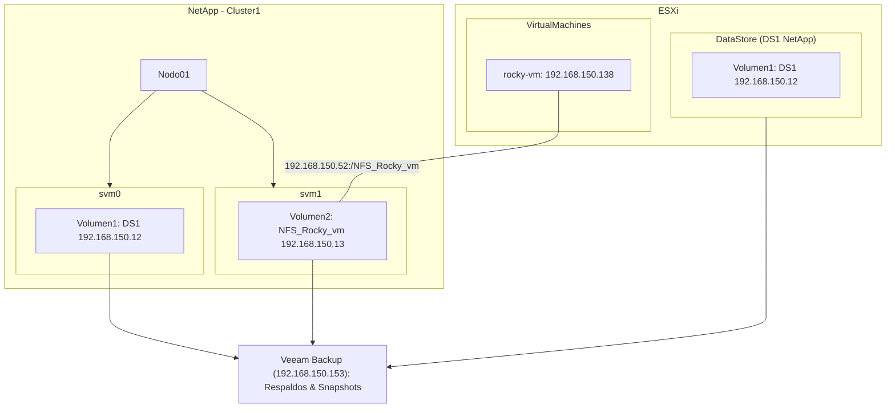

# Tutorial de Respaldo y Recuperación

Este tutorial detalla los pasos para configurar y respaldar una máquina virtual en un entorno con Veeam, VMware ESXi y NetApp.

## Configuración Inicial en `bkp-server`

### Paso 1: Conectar al Servidor
1. Conectar a `localhost:9392`, `BACKUPSERVER\backupserver`, con la contraseña.

### Paso 2: Añadir Infraestructura de Virtualización
1. Ir a `Inventory` -> `Virtual Infrastructure` -> `Add Server`.
2. Seleccionar `VMware vSphere` -> `vSphere`.
3. Introducir `192.168.150.20`, descripción y credenciales (usuario `root`).

### Paso 3: Configurar Almacenamiento
1. Ir a `Storage Infrastructure` -> `Add Storage`.
2. Seleccionar `NetApp` -> `ONTAP` -> `192.168.150.10`.
3. Configurar `Role: Block or file storage for VMware vSphere` con credenciales `admin`.
4. Dejar activado `Fiber Channel`. Verificar que esté en `Storage Infrastructure`.

### Paso 4: Configurar NetApp
1. Acceder a `192.168.150.10` en el navegador, iniciar sesión con `admin` y la contraseña.
2. Ir a `Storage` -> `Storage VMs` -> `Add Storage VM`.
3. Habilitar `NFS`, y en `Allow NFS Client Access`, añadir `192.168.150.20/24`.
4. Permitir `Read/Write Access & Superuser Access` y guardar.

### Paso 5: Crear Volumen
1. Ir a `Storage` -> `Volumes` -> `+ Add`.
2. Nombre: `DS1`, Capacidad: `10 GiB`, exportar vía `NFS`.
3. En `Access Permissions`, añadir `default` con acceso para `192.168.150.20`.
4. Deshabilitar `Enable Snapshot Copies (Local)` y guardar.

### Paso 6: Configurar Datastore en VMware ESXi
1. Copiar el acceso NFS de `DS1`, `192.168.150.12:/DS1`.
2. Ir a VMware ESXi (`192.168.150.20`) e iniciar sesión con `root`.
3. Crear `New DataStore` -> `Mount NFS datastore`.
4. Nombre: `DS1`, `NFS Server: 192.168.150.12`, `NFS Share: /DS1`, `NFS Version: NFS 3`.

### Paso 7: Configurar Almacenamiento en Veeam Backup
1. En Veeam Backup, ir a `CLUSTER1`, click derecho -> `Edit Storage`.
2. Desactivar `FiberChannel` y activar `NFS`.
3. Aplicar cambios y verificar que `svm0 -> DS1 & svm0_root` estén listados.

### Paso 8: Crear Snapshot en DS1
1. En Veeam Backup, click derecho en `DS1` -> `Create Snapshot`.

### Paso 9: Crear Máquina Virtual en VMware ESXi
1. En VMware ESXi, ir a `DataStore1` -> `Datastore Browser` -> `ISOS`.
2. Verificar que las ISOs `Rocky 8.6` y `Rocky 9.4` estén listadas.
3. Ir a `Virtual Machines` -> `Create / Register VM`.
4. Nombre: `rocky-vm`, tipo de SO: `Linux`, versión: `RedHat 8`.
5. Almacenamiento: seleccionar `DS1`.
6. Configurar `Hard Disk 1: 6GB` y seleccionar `Rocky 8.6` desde la carpeta ISOS.
7. Finalizar y arrancar la máquina virtual.

### Paso 10: Añadir VM a Veeam Backup Job
1. En Veeam Backup, ir a `Inventory` -> `Virtual Infrastructure` -> `Standalone Hosts` -> `192.168.150.20`.
2. Click derecho en `rocky-vm` -> `Add to Backup Job` -> `New Job`.
3. Nombre: `bkp_rocky-vm`.
4. Seleccionar `rocky-vm` y configurar políticas de retención.

### Paso 11: Crear Snapshot en Veeam Backup
1. Ir a `Home` -> `Jobs` -> `Backup` -> click derecho en `bkp_rocky-vm` y ejecutar el trabajo.

### Paso 12: Configurar Snapshots Adicionales en Veeam
1. Click derecho -> `Backup -> Virtual Machine...` -> Nombre: `bkp_rocky-vm-snap`.
2. Seleccionar `rocky-vm`, configurar retención a 5 puntos y ejecutar.

### Paso 13: Verificar Snapshots en NetApp
1. En NetApp (`192.168.150.10`), ir a `Storage` -> `Volumes` -> pestaña `Snapshot Copies`.
2. Verificar el snapshot `VeeamSourceSnapshot...`.

### Paso 14: Restaurar desde Snapshot en Veeam
1. En Veeam Backup -> `Inventory -> Virtual Infrastructure -> Standalone Hosts -> rocky-vm`.
2. Click derecho -> `Restore -> Instant Recovery -> From storage snapshot`.
3. Restaurar como `rocky-vm-restore` y conectar a la red.

### Paso 15: Verificar Restauración en VMware ESXi
1. En VMware ESXi (`192.168.150.20`), verificar que `rocky-vm-restore` esté listado.
2. En NetApp, ir a `Storage -> Volumes` y verificar `VeeamAux_DS1_Restore`.

### Paso 16: Migrar a Producción o Desmontar VM Restaurada
1. En Veeam Backup, ir a `Instant Recovery`.
2. Click derecho en `rocky-vm-restore`, seleccionar `Migrate to production` o `Stop Publishing` para desmontar.
3. Verificar que la VM no esté en `ONTAP` ni en `ESXi` después de desmontar.

# Video 2: Grabacion 18/10/2024: Introduccion a Scripts de Respaldo y Recuperación de la bbdd en rocky-vm

# Video 3: Instalacion de MySQL 8.0 en Rocky-VM
- Revisamos el material en bp.veeam.com/vbr/4_Operations/O_Application/mysql.html
- Revisamos el material en dev.mysql.com/doc/mysql-yum-repo-quick-guide/en/

### Paso 1: Iniciar Máquina Virtual
1. Vamos al portal de VmWare ESXi (192.168.150.20) -> e iniciamos la máquina `rocky-vm`.
2. Revisamos la IP de la máquina y nos conectamos por SSH (`192.168.150.154`) `root:password`.

### Paso 2: Instalar wget
1. Ejecutar `yum install wget`.

### Paso 3: Descargar MySQL
1. Ejecutar `wget https://dev.mysql.com/get/mysql80-community-release-el8-1.noarch.rpm`.

### Paso 4: Configurar Conexión de Red
1. Ejecutar `nmcli connection -> nmcli connection modify ens192 connection.autoconnect yes`.
2. Ejecutar `nmcli connection up ens192`.

### Paso 5: Instalar open-vm-tools
1. Ejecutar `yum install open-vm-tools`.

### Paso 6: Transferir MySQL RPM
1. En PowerShell de la máquina host, ejecutar `scp .\mysql80-community-release-el8-1.noarch.rpm root@192.168.150.154:/root`.

### Paso 7: Instalar MySQL RPM
1. Ejecutar `sudo yum localinstall mysql80-community-release-el8-1.noarch.rpm`.
2. Ejecutar `sudo yum repolist all | grep "mysql"`.

### Paso 8: Cambiar MySQL 8.4 a 8.0
1. Ejecutar `sudo yum-config-manager --disable mysql-8.4-lts-community`.
2. Ejecutar `sudo yum-config-manager --disable mysql-tools-8.4-lts-community`.
3. Ejecutar `sudo yum repolist all | grep "mysql"`.
4. Ejecutar `sudo yum-config-manager --enable mysql-80-community`.
5. Ejecutar `sudo yum-config-manager --enable mysql-tools-community`.
6. Ejecutar `sudo yum repolist all | grep "mysql" | grep enabled`.
7. Ejecutar `yum repolist enabled | grep mysql`.
8. Ejecutar `yum module disable mysql`.

### Paso 9: Instalar MySQL 8.0
1. Ejecutar `yum install -y mysql-community-server`.
2. Ejecutar `systemctl enable --now mysqld`.
3. Ejecutar `grep 'temporary password' /var/log/mysqld.log`.
4. Ejecutar `mysql -u root -p` e introducir la contraseña.
5. Ejecutar `ALTER USER 'root'@'localhost' IDENTIFIED BY 'MyNewPass4!'`.
6. Ejecutar `show databases`.

### Paso 10: Crear Base de Datos de Prueba
1. Revisar el material en `dev.mysql.com/doc/employee/en/employees-installation.html`.
2. Ejecutar `yum install git`.
3. Ejecutar `git clone github.com/datacharmer/test_db.git`.
4. Ejecutar `cd test_db`.
5. Ejecutar `mysql -u root -p < employees.sql`.
6. Ejecutar `show databases`.
7. Ejecutar `use employees`.
8. Ejecutar `show tables`.
9. Ejecutar `select * from employees limit 10`.


### Conectar desde maquina cliente a NFS
```bash
sudo mount -t nfs 192.168.150.52:/NFS_Rocky_vm /mounted/nfs_rocky_vm
```
### Manera persistente edit /etc/fstab
```
192.168.150.52:/NFS_Rocky_vm /mounted/nfs_rocky_vm defaults 0 0
```
# Video 4: 25/10/2024:

# Video 5: 26/10/2024:

Veeam Backup & Replication 12 User Guide for VMware vSphere
https://helpcenter.veeam.com/docs/backup/vsphere/overview.html?ver=120

# Credenciales
Veeam bkp-server
```yaml
User: Administrator
Pass: Password.01.
```

NetAPP Cluster 1
```yaml
IP ADM: 192.168.150.10
IP Nodo: 192.168.150.11
User: admin
Pass: netapp123
```
NetAPP Cluster 2
```yaml
IP ADM: 192.168.150.40
IP Nodo: 192.168.150.41
User: admin
Pass: netapp123
```
ESXi1
```yaml
IP Mgnt: 192.168.150.20
User: root
Pass: Password.01.
```
ESXi2
```yaml
IP Mgnt: 192.168.150.30
User: root
Pass: Password.01.
```
