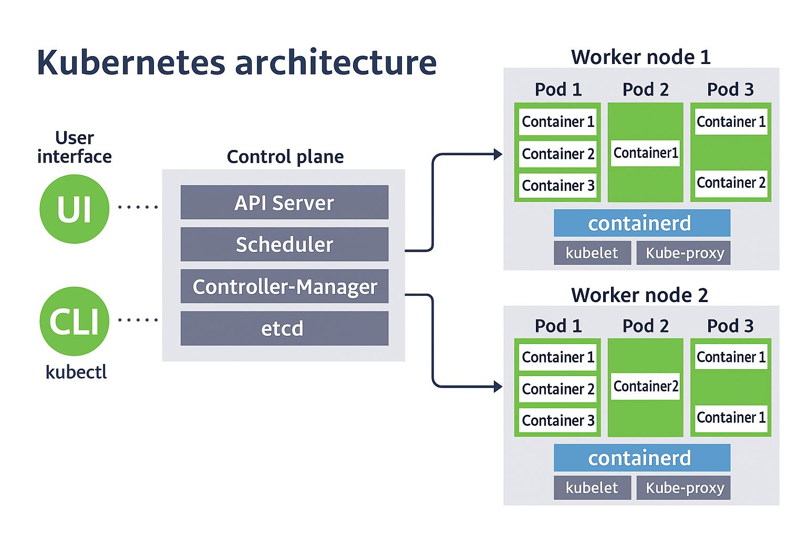
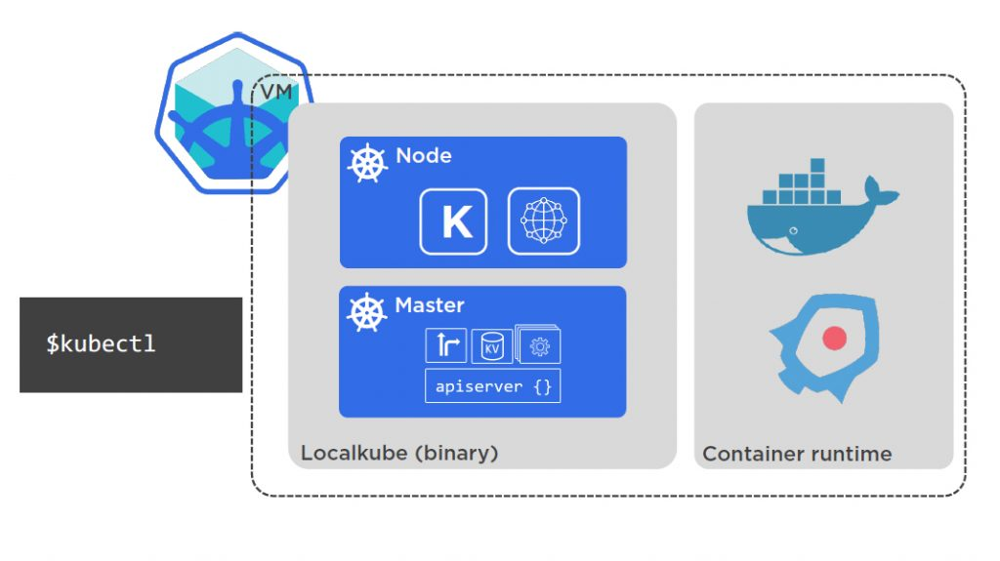

# Kubernetes
[Docs]([https://www.hunters.security/en/blog/kubernetes-security-guide](https://kubernetes.io/docs/concepts/overview/))

# Basic concepts
## Clúster
Un conjunto de nodos que ejecutan aplicaciones en contenedores. Un clúster de Kubernetes consta de un plano de control y uno o más nodos de trabajo.(todo el contenido de la imagen es la referencia a los elementos del clúster).



## Control Plane
Es el "cerebro" de Kubernetes. Administra y coordina todo el clúster.

### API Server
- Punto de entrada para todas las peticiones (UI, CLI, herramientas externas).
- Expone la API de Kubernetes y valida las peticiones.

### Scheduler
- Decide en qué nodo se colocarán los pods nuevos.
- Toma decisiones basadas en la disponibilidad de recursos, afinidad, etc.

### Controller Manager
- Ejecuta distintos controladores que regulan el estado del clúster (por ejemplo, replicar pods, reiniciar contenedores, etc.).

### etcd
- Base de datos distribuida que almacena todo el estado del clúster de Kubernetes.
- Altamente disponible y consistente.

## Worker Nodes (Nodos trabajadores)
Estos ejecutan las aplicaciones en contenedores. A physical or virtual machine that hosts one or more pods. Nodes are often referred to as worker nodes, while the control plane components (e.g. kube-apiserver, etcd, kube-scheduler) are typically hosted on the same dedicated machine as the control plane which is responsible for managing the worker nodes and the pods in the cluster that run on them orchestrated by the control plane on another dedicated machine.

- Cada nodo contiene:
    -   Pods: A wrapper (an abstraction layer) over a container. Enables users to use Kubernetes without worrying about the kind of container (i.e. agnostic to container kind). The last important aspect we should mention about pods is that they are ephemeral. That means they are designed to be relatively short-lived, easily started, stopped, or restarted to adapt to changes in workload or to recover from faults.
        -   Unidad mínima desplegable de Kubernetes.
        -   Un pod puede contener uno o más contenedores.
        -   Una o mas unidades de red y almacenamiento compartido.

    -   Runtime de contenedores
        -   Software que ejecuta los contenedores dentro de los pods. Ejemplos: Docker, Containerd, CRI-O.
        
    -   Containerd
        -   Motor de contenedores que ejecuta y gestiona los contenedores dentro de los pods.

    -   kubelet
        -   Agente que se ejecuta en cada nodo y comunica con el API Server.
        -   Se asegura de que los contenedores estén ejecutándose como deberían.

    -   Kube-proxy
        -   Maneja la red del nodo y la comunicación entre servicios.
        -   Implementa el balanceo de carga y reenvío de tráfico.

[Reference](https://www.hunters.security/en/blog/kubernetes-security-guide)

## Lab 1
```bash
# Ver los nodos del clúster
kubectl get nodes
# Ver los pods en el clúster
kubectl get pods --all-namespaces
# Ver los nodos con más detalles (incluyendo IPs, roles, SO y versión)
kubectl get nodes -o wide
```

## Local options to setup a Kubernetes cluster
- **Minikube**: Herramienta para ejecutar un clúster de Kubernetes localmente. Ideal para desarrollo y pruebas.
- **K3s**: Una versión ligera de Kubernetes, ideal para entornos con recursos limitados.
- **Kind**: Herramienta para ejecutar clústeres de Kubernetes en contenedores Docker. Útil para pruebas y desarrollo.
- **MicroK8s**: Una distribución ligera de Kubernetes que se puede instalar en una sola máquina. Ideal para desarrollo y pruebas locales.
- **Rancher Desktop**: Una aplicación de escritorio que permite ejecutar Kubernetes localmente con una interfaz gráfica. Incluye Minikube y K3s como opciones de clúster.
- **kubeadm**: Herramienta para crear clústeres de Kubernetes de manera sencilla. Permite configurar un clúster desde cero en máquinas virtuales o físicas con foco en clústeres en producción.

# Minikube architecture
Minikube bundles a single-node Kubernetes cluster with a virtual machine (VM) or container runtime. It provides a local environment for testing and development. Including the Kubernetes Master with Master Components(API server, controller manager, scheduler, and kubelet), all running on a single node. Minikube supports various container runtimes like Docker, containerd, and CRI-O.


## Install Minikube
 [Download + instructions](https://minikube.sigs.k8s.io/docs/start/?arch=%2Flinux%2Fx86-64%2Fstable%2Fbinary+download)

## Install kubectl
```bash
sudo dnf install -y kubectl
```
## Setup Minikube
Start a cluster using the docker driver:
- [driver options](https://minikube.sigs.k8s.io/docs/drivers/)
```bash
minikube start --driver=docker
```

To make docker the default driver:
```bash
minikube config set driver docker
```
### Check Minikube status
```bash
minikube status
```
### Check Minikube dashboard
```bash
minikube dashboard
```
### Create a deployment
```bash
kubectl create deployment hello-minikube --image=k8s.gcr.io/echoserver:1.10
kubectl get deployments
```
### Create deployment as service with exposed port
```bash
kubectl expose deployment hello-minikube --type=NodePort --port=8080
kubectl get services
minikube service hello-minikube --url
# Visit de IP http://127.0.0.1:40383 given from minikube service hello-minikube --url (the port may vary)
```
### delete service and deployment
```bash
kubectl delete service hello-minikube
kubectl delete deployment hello-minikube
kubectl get pods # to check if the deployment was deleted

```
