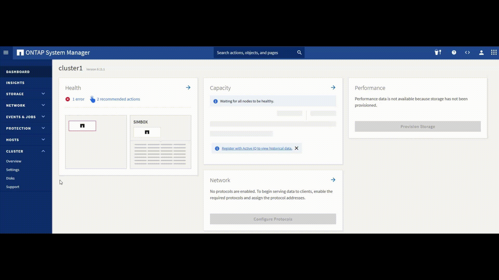
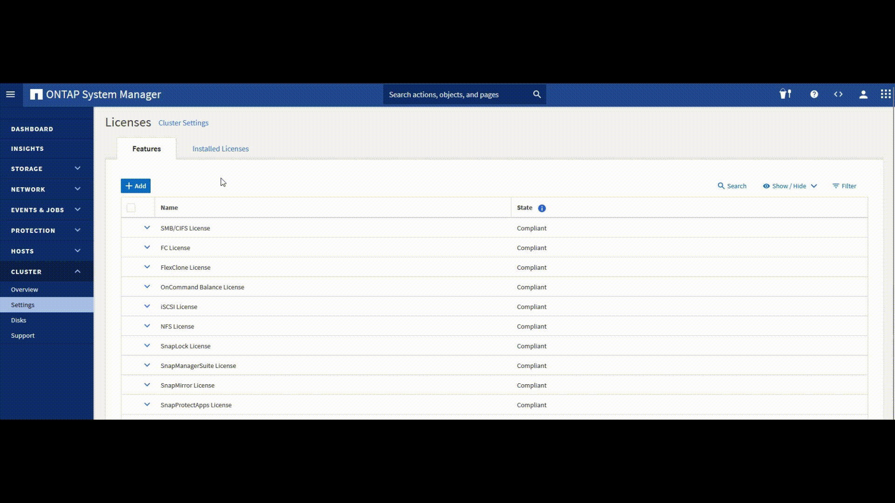
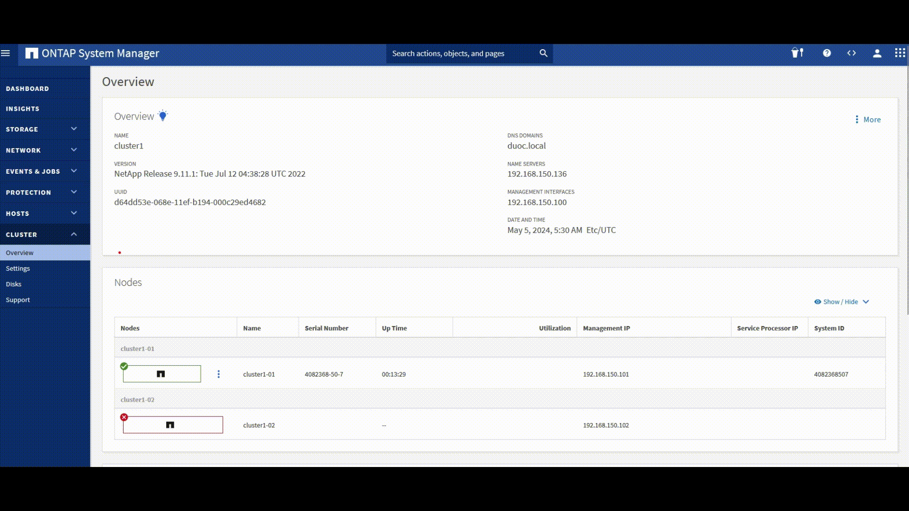
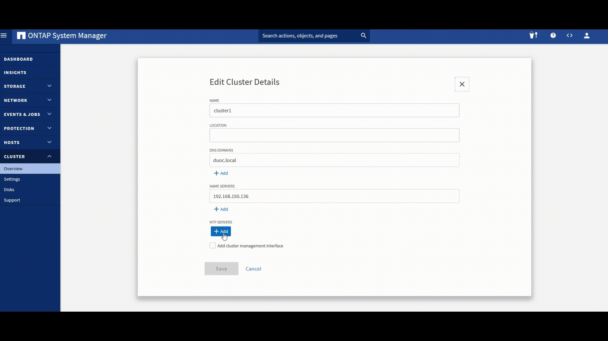
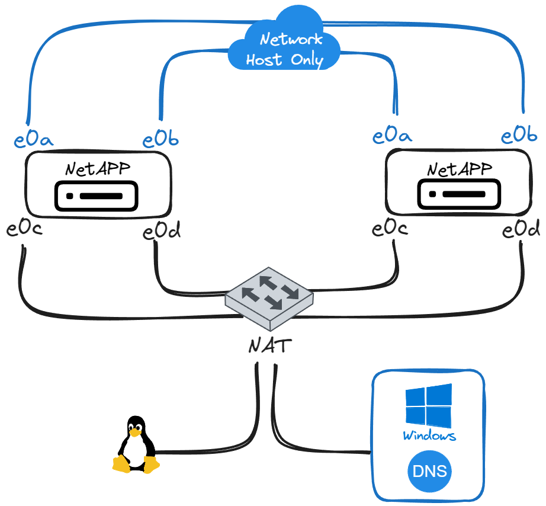

# Apuntes OnTAP

> [!NOTE]
> - Apagar el cluster: power shutdown guest en el vmware.
> - File -> exportar a OVF -> name {nombre}.ova -> asi se guarda el ova actualizado.


> [!TIP]
> - importar ovas y nombrarlas segun el nodo que corresponda, importar ambas antes de comenzar.

# Configuracion de un clúster con dos nodos
# Actividad 1 EA2
## Configuracion nodo01
- login: ```admin```
- ```cluster setup``` luego ```yes```
  - Enter the node management interface port [e0c]: ```e0c```
  - Enter the node management interface IP address: ```192.168.150.101```
  - Enter the node management interface netmask: ```255.255.255.0```
  - Enter the node management interface default gateway: ```192.168.150.2```
  - Otherwise, press enter to complete cluster setup using the command line interface: <kbd>enter</kbd>
- Do you want yo create a new cluster or join an existing cluster? {create, join}: ```create```
- Do you intend for this node to be used as a single node cluster? {yes, no}: ```no```
- Do you want to use this configuration? {yes, no}: ```yes```

### Login the cluster & config new cluster
- Enter the cluster administrator's (username "admin") password: ```netap123```
  - Enter the cluster name: ```cluster1```
  - Enter an additional license key: <kbd>enter</kbd> **Posteriormente ingresaremos las licencias mediante GUI**
  - Enter the cluster management interface port: ```e0d``` **Esto sigue siendo el nodo1, por eso es la interfaz e0d**
  - Enter the cluster management interface IP address: ```192.168.150.100```
  - Enter the node management interface default gateway: ```192.168.150.2```
  - Enter the DNS domain names: <kbd>enter</kbd> o ```el nombre de nuestro dominio``` para el ejercicio: ```duoc.local```
  - Enter the name server IP adresses: ```La ip de nuestro windows server``` 
  - Where is the controller located?: <kbd>enter</kbd>
- ```cluster show``` **Obtendrá una respuesta como esta:**
  ```
  Node            Health  Elegibility
  --------------- ------- -----------
  cluster1-01     true    true
  ```
- ```network interface show```
  ```
              
          Logical             Status        Network             Current       Current Is
  Vserver Interface           Admin/oper    Address/Mask        Node          Port    Home
  ------- ----------          ------------  -------------       ---------     ------- -----
  Cluster
          cluster1-01_clus1   up/up         169.254.70.130/16  cluster1-01    e0a      true
          cluster1-01_clus2   up/up         169.254.70.140/16  cluster1-01    e0b      true
  cluster1
          cluster1-01_mgmt1   up/up         192.168.150.101/24  cluster1-01  e0c     true
          cluster1-01_mgmt    up/up         192.168.150.100/24  cluster1-01  e0c     true 
          
  ```
> la logical interface cluster1-01_mgmt tiene la ip de management del cluster1, mientras que la cluster1-01_mgmt1 es la ip de management del nodo1 del cluster 1 ambas estan en la puedta e0c 

> [!IMPORTANT]
> Aún falta configurar la interfaz e0c & e0d del nodo2, por eso no aparece en este resultado, si no aparecen, configurar y volver a consultar.

## Configuracion nodo 2
- apretar cualquier tecla para poder entrar a la consola, deberías ver: ```VLOADER>``` en el prompt.
- ```setenv sys_serial_num 4034389-06-2```
- ```setenv bootarg.nvram.sysid 4034389062```
- **Verificar si la info se guardo correctamente con: Deben retornar los valores ingresados**
  - ```printenv sys_serial_num```
  - ```printenv bootarg.nvram.sysid```
- ```boot```
- login: ```admin```
- ```cluster setup```
  - ```yes```
  - Enter the node management interface port: ```e0c```
  - Enter the node management interface ip address: ```192.168.150.102```
  - Enter the node management interface netmask: ```255.255.255.0```
  - Enter the node management interface default gateway: ```192.168.150.2```
  - Otherwise press Enter to complete cluster setup using the command line interface: <kbd>enter</kbd>
  - Do you want to create a new cluster or join an existing cluster?: ```join```
  - Do you want to use this configuration? {yes, no}: ```yes```
  - Enter the ip from the cluster you want to join: **```Ingresar la ip de la interfaz e0a del nodo 1```
  - cluster show
  - network interface show
  ```
  Node            Health  Elegibility
  --------------- ------- -----------
  cluster1-01     true    true
  cluster1-02     true    true
  2 entries were displayed
  ```
- ```network interface show```
  ```
          Logical             Status        Network             Current       Current Is
  Vserver Interface           Admin/oper    Address/Mask        Node          Port    Home
  ------- ----------          ------------  -------------       ---------     ------- -----
  Cluster
          cluster1-01_clus1   up/up         169.254.70.130/16  cluster1-01    e0a      true
          cluster1-01_clus2   up/up         169.254.70.140/16  cluster1-01    e0b      true
          cluster1-01_clus1   up/up         169.254.70.239/16  cluster1-02    e0a      true
          cluster1-01_clus2   up/up         169.254.70.249/16  cluster1-02    e0b      true
  cluster1
          cluster1-01_mgmt1   up/up         192.168.150.101/24  cluster1-01  e0c     true
          cluster1-02_mgmt1   up/up         192.168.150.102/24  cluster1-01  e0c     true
          cluster1-01_mgmt    up/up         192.168.150.100/24  cluster1-01  e0c     true 
  ```

  ### Disable root snapshots
  - ```run -node cluster1-0* snap delete -a -f vol0```
  - ```run -node cluster1-0* snap sched vol0 0 0 0```
  - ```run -node cluster1-0* snap autodelete vol0 on``` 
  - ```run -node cluster1-0* snap autodelete vol0 target_free_space 35``` 
  ### Configuración de aggregate
  - ```disk show``` **muestra los discos**
  - ```disk assign -node cluster1-01 -all true``` **asigna todos los discos que no esten asignados**
  - ```disk assign -node cluster1-02 -all true``` **asigna todos los discos que no esten asignados**
  - ```storage aggregate add-disks -aggregate aggr0_cluster1_01 -diskcount 1```
    - ```y```
    - ```y```
  - ```aggr show``` **Para listar los aggregate**

  - ```storage aggregate add-disks -aggregate aggr0_cluster1_02 -diskcount 1```
    - ```y```
    - ```y```
  - ```aggr show```
  - ```vol size -vserver cluster1-01 -volume vol0 -new-size 2.3g```
  - ```aggr show```
  - ```vol size -vserver cluster1-02 -volume vol0 -new-size 2.3g```
  - ```aggr show```

  # Actividad 1 EA2
> [!NOTE]
> Siempre usar el https para entrar al panel de administracion del ontap 
> Registre todas las licencias disponibles para ambos nodos del cluster.
  ## Agregar las licencias
  - Ingresar a la web de administracion del cluster en la ip ```.100```
  - Paso1:
  
  - Paso2:
  
  ### 01 Node licenses
  ```
  YVUCRRRRYVHXCFABGAAAAAAAAAAA, 
  WKQGSRRRYVHXCFABGAAAAAAAAAAA,  
  SOHOURRRYVHXCFABGAAAAAAAAAAA,
  YBSOYRRRYVHXCFABGAAAAAAAAAAA,
  KQSRRRRRYVHXCFABGAAAAAAAAAAA,
  MBXNQRRRYVHXCFABGAAAAAAAAAAA,
  QDDSVRRRYVHXCFABGAAAAAAAAAAA,
  CYAHWRRRYVHXCFABGAAAAAAAAAAA,
  GUJZTRRRYVHXCFABGAAAAAAAAAAA,
  OSYVWRRRYVHXCFABGAAAAAAAAAAA,
  UZLKTRRRYVHXCFABGAAAAAAAAAAA,
  EJFDVRRRYVHXCFABGAAAAAAAAAAA
  ```
  ### 02 Node licenses
  ```
  MHEYKUNFXMSMUCEZFAAAAAAAAAAA,
  KWZBMUNFXMSMUCEZFAAAAAAAAAAA, 
  GARJOUNFXMSMUCEZFAAAAAAAAAAA,
  MNBKSUNFXMSMUCEZFAAAAAAAAAAA,
  YBCNLUNFXMSMUCEZFAAAAAAAAAAA,
  ANGJKUNFXMSMUCEZFAAAAAAAAAAA,
  EPMNPUNFXMSMUCEZFAAAAAAAAAAA,
  QJKCQUNFXMSMUCEZFAAAAAAAAAAA,
  UFTUNUNFXMSMUCEZFAAAAAAAAAAA,
  CEIRQUNFXMSMUCEZFAAAAAAAAAAA,
  ILVFNUNFXMSMUCEZFAAAAAAAAAAA,
  SUOYOUNFXMSMUCEZFAAAAAAAAAAA
  ```

  ## 1. Renombrar aggr0
  ### Modifique el nombre por defecto del aggr0 de ambos nodos del cluster a los siguientes: “n1_aggr0” y “n2_aggr0”:
  - ```aggr rename -aggregate aggr0_cluster1_01 -newname n1_aggr0```
  - ```aggr rename -aggregate aggr0_cluster1_02 -newname n2_aggr0```

  ## 2. Configuración DNS Server
  - Configure los servidores DNS por cada uno de los nodos que componen el cluster. Configure el siguiente DNS: **```192.168.150.136```** o la **ip** de nuestro Windows Server.
   
  ## 3. Configuración de Fecha y Hora (NTP Server)
  - Configure la fecha y hora del sistema (cluster), considerando agregar como servidor NTP Server: **```server1.duoc.local```**.
   
  - Paso 2:
   

## Probar conexión entre nodos, check hr, zona horaria
- ```ping -node cluster1-01 -destination server1.duoc.local```
  - responde server1.duoc.local is alive
- ```ping -node cluster1-02 -destination server1.duoc.local```
  - responde server1.duoc.local is alive
- ```date #```-> para checkear la hora correcta
- Checkear la zona horaria de los nodos en el cluster.
- Definir la zona horaria ```timezone America/Santiago```
-  Definir la fecha y hora manualmente formato fecha "mm/dd/yy" hh:mm:ss :```cluster date modify -date "01/01/2011 01:00:00"``` 

## 4) Creacion de aggregate de datos
### Cree los siguientes aggregate de datos, considerando la siguiente información:
### Aggregate 1
 - Nombre del Aggregate: n1_aggr1
 - Nodo Cluster: cluster1-01
 - Tipo de Raid: RAID-DP
 - Raid Size: 11
 - Cantidad de Discos: 11
### Aggregate 2
 - Nombre del Aggregate: n2_aggr1
 - Nodo Cluster: cluster1-02
 - Tipo de Raid: RAID-DP
 - Raid Size: 11
 - Cantidad de Discos: 11
### Desarrollo item 4:
- En la interfaz grafica:
  - Storage ➡️Tiers➡️Add local Tier o Add Cloud Tier en este caso el local: Te muestra una recomendacion para el aggregate ➡️ switch manual configuration ➡️ name: n1_aggr1, number of disks 11, raid-DP, raid group size 11➡️save
   
   

- CLI:

  ```aggr create -aggregate n2_aggr1 -maxraidsize 11 -diskcount 11 -raidtype raid_dp - node cluster1-02```

## 5. Creacion de usuarios

### 5.1 
> Configurar el cluster con el objetivo de poder utilizar los usuarios del dominio para conectarnos al storage vía SSH y por System Manager. En lo específico, permite que el administrador del dominio (DUOC\Administrador) posea los mismos privilegios de administración que el usuario “admin”.

#### Asignar users al cluster en la consola
- ``` security login show``` para revisar los usuarios del cluster con sus detalles
- ``` security login domain-tunnel show```
- ``` security login domain-tunnel create -vserver svm0```
- ``` security login domain-tunnel show```
- ``` security login create -usner-or-group-name DUOC\Administrator -application ssh -authentication-method domain -role admin```
- ``` security login show```
- ``` testeo con otra ventana en el putty -> DUOC\Administrator -> Duoc.1234```
- ```security login create -user-or-group-name DUOC\Administrator -application http -authentication-method domain -role readonly```
- ```security login create -user-or-group-name DUOC\Administrator -application ontapi -authentication-method domain -role readonly```

### 5.2
> Cree una llave privada/pública SSH, con el objetivo de poder loguearnos al usuario “admin” utilizando dicha llave y que no solicite contraseña.

#### generar las llaves para ssh
1. instalar putty key generator
2. generar con ```generate``` y mover el mouse que usa esos parametros para definir la llave
3. ```Save private key``` y la dejamos en el escritorio de donde nos estamos conectando por ssh
4. tomar todo el texto de la llave
5. ir a la consola
6. ```security login publickey show```
7. ```security login create -user-or-group-name admin -application ssh -authentication-method publickey -role admin``` #el indice es para generar varias claves publicas para un mismo usuario
8. ```security login publickey create -username admin -index 0 "texto llave" -comment administradorKevin```

1. PuTTY ➡️ Connection ➡️ SSH ➡️ Auth ➡️ Private key file for authentication y seleccionar el archivo
2. connection ➡️ data agrego el nombre del user, solo con seleccionar el perfil y conecta sin pedir user ni passwd

#### Generar las claves en linux
  ```ssh-keygen -t rsa -b 2048```

  ``` cat ~/.ssh/id_rsa.pub```
  - Copiar desde ssh hasta el final del string omitiendo el user
  
# Sábado 27/04
# Actividad 2 EA2 CIFS & NFS


## Creación de VServer (SVM) NFS CIFS

1. Storage ➡️ Storage VMs provisionan un protocolo de almacenamiento como NFS o CIFS ➡️ + Add ➡️ Storage VM Name: svm0 ➡️ Enable SMB/CIFS ➡️ Enable NFS ✅.
2. Enable SMB/CIFS: Administrator name: ```Administrador``` (Usuario de AD) ➡️ Password: ```pw del usuario``` ➡️ Server name (Nombre del VMServer): ```nas``` ➡️ Active Directory Domain: ```duoc.local``` ➡️ Organizational Unit: ```CN=Computers```
3. DNS Details ➡️ Domains: ```duoc.local``` ➡️ Name servers: ```192.168.150.136``` ➡️ ✅ Enable NFS.
4. cluster1-01, se define una ip para redirigir el trafico cuando hay alto trafico ➡️ IP Address: ```192.168.150.111``` Subnet mask: ```24``` Gateway: ```192.168.150.2```. ✅ Use the same subnet mask and gateway for all the following interfaces. cluster1-02: IP Address: ```192.168.150.112```
5. Save 

6. En el panel de ```Administrador del servidor``` en el WServer ➡️ duoc.local(Dominio especificado antes) ➡️ Computers(OU especificado antes) ➡️ Veremos el equipo llamado ```nas```

7. Storage ➡️ Volumes ➡️ Add ➡️ Rellenar los parametros segun requerimiento, ✅ Share via SMB/CIFS ➡️ More options ➡️ Access Permissions: segun requerimiento, para el ejemplo: Grant Access To user(s): ```Everyone```, Permission: ```Full Control```

8. Ir a equipo cliente conectado al dominio, Este equipo, Click derecho ➡️ Conectar a unidad de red... ➡️ Carpeta: ```192.168.150.111\volume_name```➡️ Finalizar. Lo mismo sirve para la IP ```.112``` 

> [!NOTE] Network interface
> cada VMserver tiene su propia ip, -> cluster1-01 192.168.150.111, subnet 24, gateway 192.168.150.2
> cada VMserver tiene su propia ip, -> cluster1-01 192.168.150.112, subnet 24, gateway 192.168.150.2

**Modificar la puerta de administracion con la ip:** 
- ```network interface modify -vserver {vserver name} -lif {logical interface (la de management)} -service-policy default-management```

## 1. Crea un broadcast domain "DATA"
> Crea un broadcast domain "DATA"considerando los puertos cluser1-01:e0d como miembros
  - ```broadcast-domain show```
  - ```broadcast-domain remove-ports -broadcast-domain {nombre del broadcast} -ports cluster-01:e0d, cluster1-02:e0d```
  - ```broadcast-domain create -broadcast-domain {nombre del broadcast} -mtu 1500 -ports cluster-01:e0d, cluster1-02:e0d```

## 2.  **Crea unos aggregate de datos:**
> Cree un aggregate de datos con 23 discos y “raid size” 23, en cada uno de los nodos del cluster.  El nombre de los aggregate debe ser: n1_aggr1 (cluster1-01) y n2_aggr1 (cluster1-02).
- Tiers ➡️ Add local tier: name n1_aggre1 ➡️ raid group size 23


# 30/04
## 3. Cree un vserver (SVM) llamado “vsDATA”
> Cree un vserver (SVM) llamado “vsDATA”, con el objetivo de provisionar datos vía NFS y CIFS. Para esto considere:
- Nombre SVM: **```vsDATA```**
- Data Protocols: ```NFS, CIFS```
- Broadcast Domain: ```DATA```
- CIFS NAME: ```nas```
- Active Directory: ```server1.duoc.local``` (```192.168.150.136```)
- Admin Name:	```Administrador```
- Admin Pass: ```Duoc.1234```

### Cree los siguiente volúmenes, asociados al storage virtual machine vsDATA:
```	
Nombre  Tamaño  Export Rules
------  ------  -----------------------	                  
VOLR		2GB		  Read Write  (0.0.0.0/0)      
VOLW		3GB		  Read Write  (0.0.0.0/0)         
SHARED	4GB		  Read Write  (0.0.0.0/0)        
```

### En un servidor Linux (RHEL), configure los siguiente puntos de montaje, con el objetivo de utilizar los volúmenes recién creados, cada vez que se inicia el sistema operativo (montaje automático).
```
Punto Montaje (RHEL)	NFS Export
/mnt/VOLR			<data_lif_nfs>:/VOLR
/mnt/VOLW			<data_lif_nfs>:/VOLW
/mnt/SHARED			<data_lif_nfs>:/SHARED
```
### Utilizando el Active Directory W2016 (duoc.local), configure el protocolo CIFS en el vserver vsDATA y así compartir  
```
Share			Junction- Path		Permission
VOLR			/UNIX/VOLR			Everyone (Read Only)
VOLW			/UNIX/VOLW			Everyone (Read Only)
SHARED		/WINDOWS/CIFS		Everyone (Read Only)
```
### Mapeo de Recursos de Red:
```
\\<data_lif_cifs>\VOLR
\\<data_lif_cifs>\VOLW
\\<data_lif_cifs>\SHARED
```

1. Storage ➡️ Storage VMs provisionan un protocolo de almacenamiento como NFS o CIFS ➡️ enable SMB/CIFS, NFS ✅.
2. name vsDATA ➡️ Administrator name: ```Administrador``` (Usuario de AD) ➡️ Password: ```Duoc.1234``` ➡️ Server name (Nombre del VMServer): ```nas``` ➡️ Active Directory Domain: ```duoc.local``` ➡️ Organizational Unit: ```CN=Computers```
3. DNS Details ➡️ Domains: ```duoc.local``` ➡️ Name servers: ```192.168.150.136``` ➡️ ✅ Enable NFS.
4. Add new rule, client spec 192.168.150.0/24 y habilitar todos los permisos excepto por anonymous y los access protocol
5. cluster1-01, se define una ip para redirigir el trafico cuando hay alto trafico ➡️ IP Address: ```192.168.150.111``` Subnet mask: ```24``` Gateway: ```192.168.150.2``` Broadcast Domain: DATA. ✅ Use the same subnet mask and gateway for all the following interfaces. cluster1-02: IP Address: ```192.168.150.112```
5. Save 

7. En el panel de ```Administrador del servidor``` en el WServer ➡️ duoc.local(Dominio especificado antes) ➡️ Computers(OU especificado antes) ➡️ Veremos el equipo llamado ```nas```

8. Storage ➡️ Volumes ➡️ Add ➡️ Rellenar los parametros segun requerimiento, ✅ Share via SMB/CIFS ➡️ More options ➡️ Access Permissions: segun requerimiento, para el ejemplo: Grant Access To user(s): ```Everyone```, Permission: ```Full Control```

9. Ir a equipo cliente conectado al dominio, Este equipo, Click derecho ➡️ Conectar a unidad de red... ➡️ Carpeta: ```192.168.150.111\volume_name```➡️ Finalizar. Lo mismo sirve para la IP ```.112``` 

- edit nfs y solo dejar la version 3, deshabilitar las otras versiones.
- Storage -> crea uno por defecto para su vserver (no tocar!), add volume, nfs export via nfs grantacces to host default
- share via smb/cifs, name volr, grant access to user: Everyone o el user, permission read,save

- ahora abrimos el linux Rhel8
- mkdir /mnt/VOLR
- mount -t nfs 192.168.150.21:/VOLR /mnt/VOLR
- df -h para revisar los montajes
- cd /mnt/VOLR
- touch test.txt

en windows, montar una unidad de red \\192.168.150.22\VOLR aqui solamente me deja leer pero no modificar
